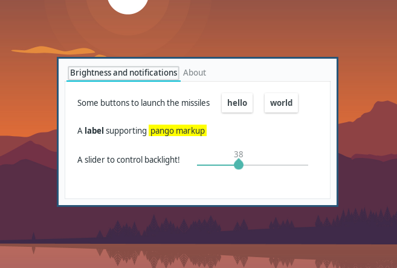

# Dama


## Disclaimer

I don't know what I am doing, this is a learning experience for me.
I intend for this to become a usable menu, but it might take a while for me to get there.

## Desktop Agnostic Menu Aggregate

This program aims to be a hackable, easy to use menu that can be paired to 
lightweight window managers in order to change settings on the fly.

## Looks

here's a screenshot with the `adapta` gtk theme



## feature roadmap

- [x] correctly render hardcoded components
- [x] parse components from a `json` file at startup
  - [x] look in multiple locations before giving up
- [X] interact with provided scripts
  - [x] execute commands (e.g. change brightness with a slider)
  - [X] get values back from commands (e.g. set the correct value for the brightness slider at startup)
- [x] add support for image widgets
  - [ ] dynamically resize the image
- [x] add support for checkbox widgets
- [ ] style the layout in a sensible way
  - [x] allow setting names for tabs
  - [ ] move the tab list to the side


## Dependencies

Dama is built with rust, using the `gtk` crate and uses `cargo` to manage the build process.

## Installation


just run the command:
```
make install
```

## writing your own menu entries

menu entries are read from json files listed in a file called `config`.
The program will look for it in `$XDG_CONFIG_HOME/dama/` 
if the variable is set, or in `$HOME/.config/dama` if it is not.

if that file doesn't exist, dama will try to read from `$HOME/.dama/config`.

each line of your `config` should be the full path to a json file describing a menu entry.

Available entries are of types:

```
{"Notebook" : [
      // list of children
]},

{"Box": [ "name", 
	  // this is used to set the tab's name if the box 
	  // is a direct child of a notebook.
	  // Otherwise, it is ignored and can be left empty.
	  "Vertical", 
          // or  Horizontal
      [
	  // list of children
      ]
]},

{"Label": "some text"},

{"Image": "/absolute/path/to/image"} 
            // the image will not be resized, you will have to resize 
            // the source file for the time being

{"Button": ["the button's label", 
            "notify-send \"click!\""]
            // the command to be executed on click 
}, 

{"Checkbox": ["echo true",
			// command providing initial state
            "notify-send $DAMA_VAL"]
            // the command to be executed on toggle
}, 

{"Scale": [0.0,   
           // the minimum value
           100.0,  
           // the maximum value
           "xbacklight -get",
           // the command to run in order to get the initial value.
           // this will be clamped between maximum and minimum values.
           "xbacklight -set $DAMA_VAL"] 
           // the command to be executed when the slider is moved.
           // the current value of the slider is available through                              
           // the environment variable $DAMA_VAL, rounded to an integer.
}                             
```
A toplevel `Notebook` is implicitly added as a container for your entries.

all commands are executed with `sh -c`.

In a horizontal `Box`, if the first element is a `Label`, it will expand to push
the remaining elements to the right of the window. This should result in a tidier layout.

